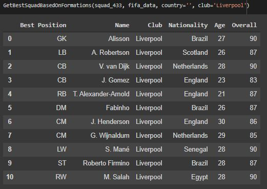
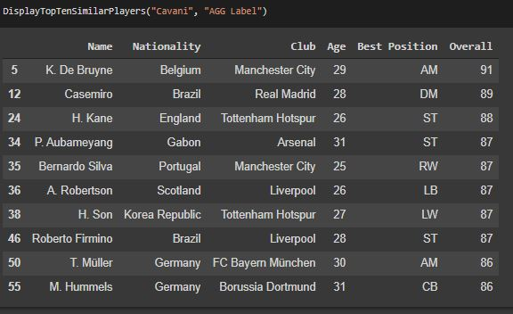

# FIFA-21-Data-Analysis-and-Clustering

 

## Business Objectives :

FIFA 21 is a football simulation video game developed by EA Vancouver as part of Electronic Arts’ FIFA series. As a football fan and game player, the aim of the project is to perform Exploratory Data Analysis on the dataset.

The dataset contains lot's of information, regarding players physical attributes as well as their wages, playing positions and national backgrounds. This provides us with wide variety of opportunities to analyze the correlations of different attributes, compute statistical quantities, representing the averages of characteristics needed, to become a professional player and so on. We also can apply supervised and unsupervised learning techniques to obtain new knowledge about the specifics of some groups of players as well as derive general conclusions of the dataset as a whole.

## Data Collection :

The dataset has been obtained from kaggle. 

Link : https://www.kaggle.com/bryanb/fifa-player-stats-database

## Modelling :

The following modelling approach was used in the project:

1. Loading and cleaning the raw data
2. Exploratory Data Analysis
3. Applying Clustering Algorithms

The detailed analysis and model creation can be found in the .ipynb file. 

## Result :

The best 11 based on ratings for a team is given as below:

The top similar players based on clustering is given as below:

## Conclusion :

The objective was to explore the FIFA 21 dataset and apply different clustering algorithms, which we were successfully able to do.
